```{r setup, echo=FALSE, include=FALSE}
knitr::knit_hooks$set(mysize = function(before, options, envir) {
  if (before) 
    return(options$size)
})
knitr::opts_chunk$set(size='\\small')
knitr::opts_chunk$set(warning=FALSE)
knitr::opts_chunk$set(message=FALSE)
knitr::opts_chunk$set(fig.align='center')

require(tidyverse)
```


## 스터디는?

- 데이터뽀개기 커뮤니티(https://www.facebook.com/groups/databreak/) 스터디입니다
- 매주 수요일 진행 (7 ~ 8월)
- 장소는 판교에서 진행 (다만 이후 변경되면 재공지 할 예정)

[github 주소](https://github.com/KaggleBreak/Statistical-Inference)

- github 레퍼지토리는 clone 하셔서 발표 자료는 github 통해서 올려주세요!
  
[스터디원 명부 : github 주소 적어주세요, 구글드라이브](https://docs.google.com/spreadsheets/d/1-FL8Wk6RutM_wM-omrLwd6h5S9LYXh42roDehZPn9eg/edit?usp=sharing)


## 교재?

- http://www.yes24.com/Product/Goods/71829251 (번역본)
- https://web.stanford.edu/~hastie/CASI_files/PDF/casi.pdf (영문판)

- 영문판으로 보셔도 되고, 번역본으로 보셔도 됩니다. 편하신 대로


## 스터디 진행 방식

- 발표 주제별로 ~최소 30분 준비 (+ 시간이 남는다면 추가로 본인이 하는 일과 관련있게 준비해도 되고, 시간을 못 채우시면 다른 데이터 분석 주제를 넣으셔도 됩니다.)
- 파트1 스터디 하면서 최소 1번 발제를 진행 (**2번 권장**)
- 스터디 빠지면 벌금을 걷을까?


## 스케줄 계획표 (Part1 커리큘럼)

\FontSmall

|요일   |주제   |발표자   |발표자료   |비고|
|---|---|---|---|---|
|2019.07.03(수)|1. 알고리즘과 추론|이희재|||
||2.빈도주의 추론|이상열||
|2019.07.10(수)|3.베이즈 추론||||
||4.피셔 추론과 최대우도 추정|||
|2019.07.17(수)|5.모수적 모델과 지수 패밀리||||
||6.경험적 베이즈|||
|2019.07.24(수)|7.제임스-스타인 추정과 리지 회귀||||
||8.일반화된 선형 모델과 회귀 트리|||
|2019.07.31(수)|9.생존 분석과 EM 알고리즘||||
||10.잭나이프와 부트스트랩|||
|2019.08.07(수)|11.부트스트랩 신뢰구간||||
||12.교차 검증과 Cp 예측 오차 추정|||
|2019.08.14(수)|13.객관적 베이즈 추론과 마르코프 체인 몬테 카를로(1)||||
||13.객관적 베이즈 추론과 마르코프 체인 몬테 카를로(2) + 14장 마무리|||
|2019.08.21(수)|15.대규모 가설 검정과 거짓 발견율||||
||16.희소 모델링과 라소|||
|2019.08.28(수)|17.랜덤 포레스트와 부스팅(1)||||
||17.랜덤 포레스트와 부스팅(2)|||


## 자기소개 (TMI)

- 자신을 편하게 소개해주세요! 
- 이름 / 하는 일 / 스터디 하는 이유 / TMI (관심있는 취미, 활동, 스포츠, 아무거나 말하고 싶은 것)


## 스터디 1번째 시간

- 1장 알고리즘과 추론 (이희재)
- 2장 빈도주의 추론 (이상열)


## 발표

- 2장 빈도주의 추론


## 2-1. GFR

\FontSmall

- 신장환자 예제 (211명의 신장 기능검사 결과)
- 스탠포드 대학의 브라이언 마이어스 (Bryan Myers) 박사 신장학 연구소의 211 명의 신장 환자의 사구체 여과율 측정
- gfr(사구체여과율 : glomerular filtration rate)
- 신장기능의 저하를 일으키는 질환에서 수치가 낮고, 경중을 판단하는 지표로 사용
- 수치가 90 이상일 경우 신장 기능의 90%을 유지됨을 의미

[gfr, kidney function](https://m.blog.naver.com/PostView.nhn?blogId=natboy0611&logNo=221269133067&proxyReferer=https%3A%2F%2Fwww.google.com%2F)

{width=250px}

## 2-2. GFR (R code)

```{r}
gfr_url <- "https://web.stanford.edu/~hastie/CASI_files/DATA/gfr.txt"
gfr <- read_csv(gfr_url, col_names = F)
print(paste0("mean? ", mean(gfr$X1)))
print(paste0("sd? ", sd(gfr$X1)))
```

## 2-3. GFR (R code)

```{r}
hist(gfr$X1, col = "green",breaks = 31, xlim = c(20, 100))
```

## 2-4. 모수와 통계량

\begincols
  \begincol{.50\textwidth}
  
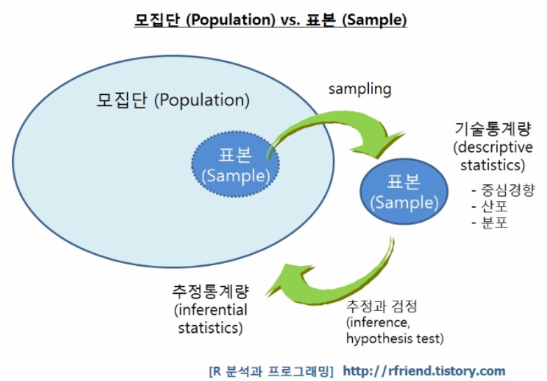{width=250px}

  \endcol
\begincol{.50\textwidth}

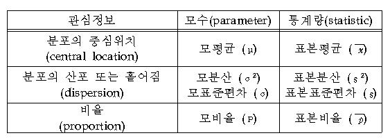{width=250px}

  \endcol
\endcols


## 2-4. 미지의 분포 F (1)

\begincols
  \begincol{.50\textwidth}
  
[참고 블로그](https://blog.naver.com/mykepzzang/220862687042)

- 관측 추정치 theat hat(단일 숫자)의 정확도란 theta의 추정치로서의 확률적 정확도
- 빈도주의는 대게 **미래의 무한한 연속적 시도**에 대해 정의

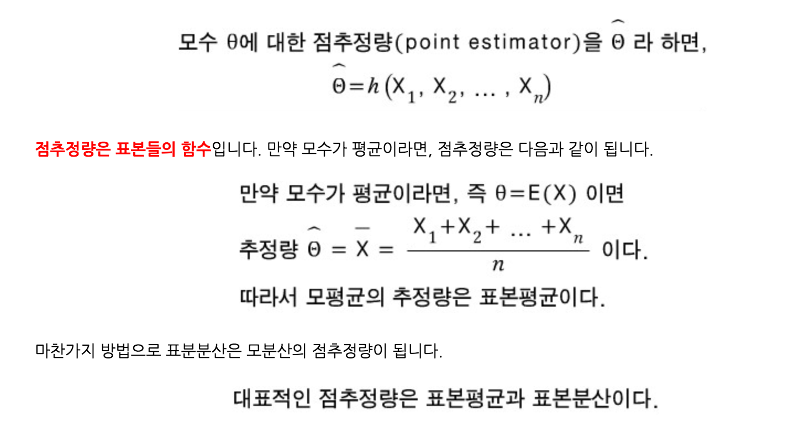{width=250px}

  \endcol
\begincol{.50\textwidth}

- 가상의 데이터 집합 X(1), X(2), X(3), ... (빈도주의 원칙은 theat hat은 대문자 세터 값들의 앙상블이 가지는 성질에 대한 정확도, 동일한 상황을 다시 실행하면 어떤 현상이 나타날까??)

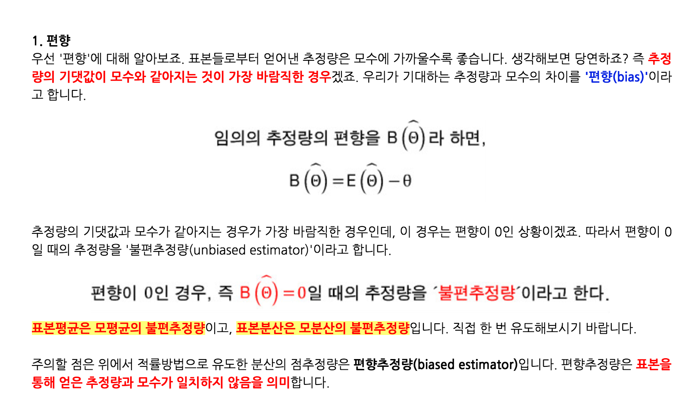{width=250px}

  \endcol
\endcols


## 2-4. 미지의 분포 F (2)

\begincols
  \begincol{.50\textwidth}
  
[참고 블로그](https://blog.naver.com/mykepzzang/220862687042)

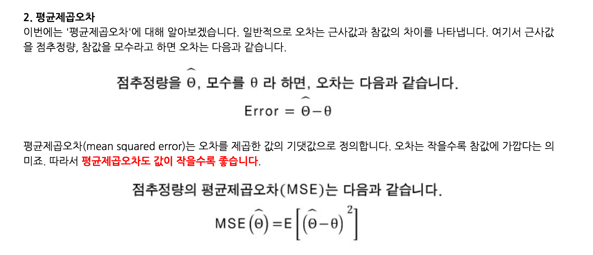{width=300px}

  \endcol
\begincol{.50\textwidth}

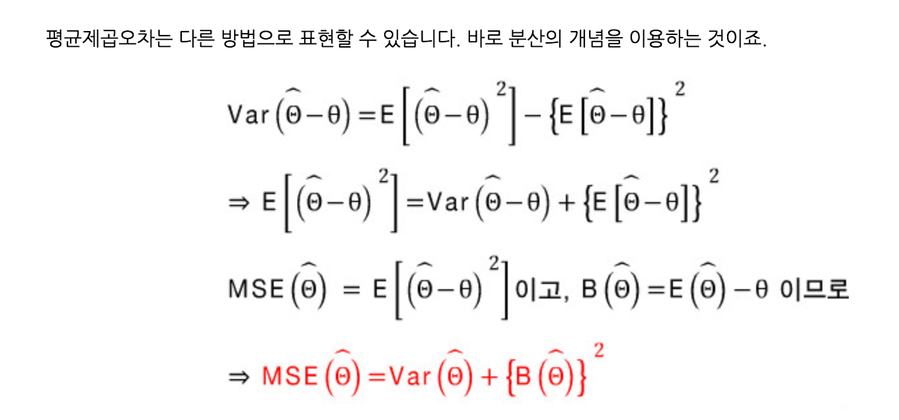{width=300px}

  \endcol
\endcols


## 3-1. 실제에서의 빈도주의

- 빈도주의에 대한 실용적 주의

> 관심 대상 절차의 확률적 속성을 도출한 다음, 그대로 절차의 출력에 적용해 관측 데이터를 구성하는 것. 헛점은 참 분포 F를 알 수 없어도 참 분포 F로부터 추정량의 성질을 계산해야 함

- 우회하기 위해 여러가지 테크닉 사용

1. 플러그인 원리
2. 테일러 급수 근사
3. 모수적 패밀리와 최대 우도 이론
4. 시뮬레이션과 부트스트랩
5. 피봇 통계량


## 3-2. 플러그인 원리 (1)

[표본표준편차와 표준오차의 구분](https://freshrimpsushi.tistory.com/541)

1. 표본 평균 : $\displaystyle \overline{x} = {{1} \over {n}} \sum_{i=1}^{n} x_{i}$

2. 표본 표준편차 : $\displaystyle s_{x} = \sqrt { {{1} \over {n-1}} \sum_{i=1}^{n} ( x_{i} - \overline{x} )^2 }$

3. 표준 오차 : $\displaystyle \text{s.e.}( \hat{x} ) = {{ s_{x} } \over { \sqrt{n} }}$


## 3-2. 플러그인 원리 (2)

- 표준오차는 표본평균의 표준편차다.
- 표준오차는 모집단에 대해서는 딱히 어떤 정보도 주지 않는다.
- 표준오차는 아무 말이 없어도 표본에 대해서만 논한다. 즉, '모표준오차'와 같은 개념은 생각하지 않는다.
- 표준오차는 주로 신뢰구간이나 예측구간을 구할 때 필요한 것이다. 즉, 맥락 상 구간 이야기가 있을 때만 신경쓰면 된다.
- 관측치가 있다면 표본 표준편차를 표준 오차에 대입하면 표준오차(hat)이 되고, 표본 평균의 표준 오차에 대한 일반적 추정이 됨
- 표본 평균에 대한 빈도주의 측면의 정확도 추정은 관측 데이터 그 자체로부터 추정


## 3-3. 테일러 급수 근사 (1)

\begincols
  \begincol{.50\textwidth}
  
- 테일러 급수란? 좋은 동영상 [테일러급수 알아보기](https://www.youtube.com/watch?v=Ku2B3_GF7KI)

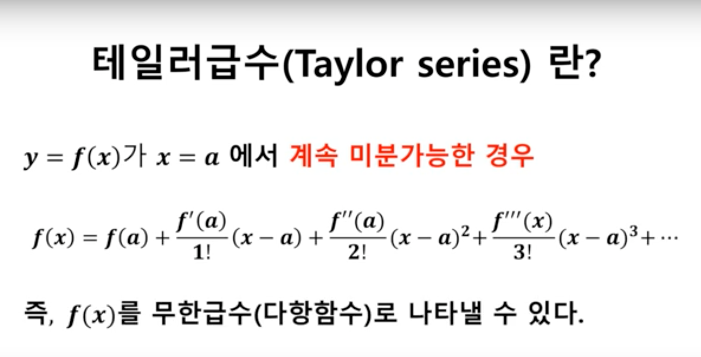{width=250px}

  \endcol
\begincol{.50\textwidth}

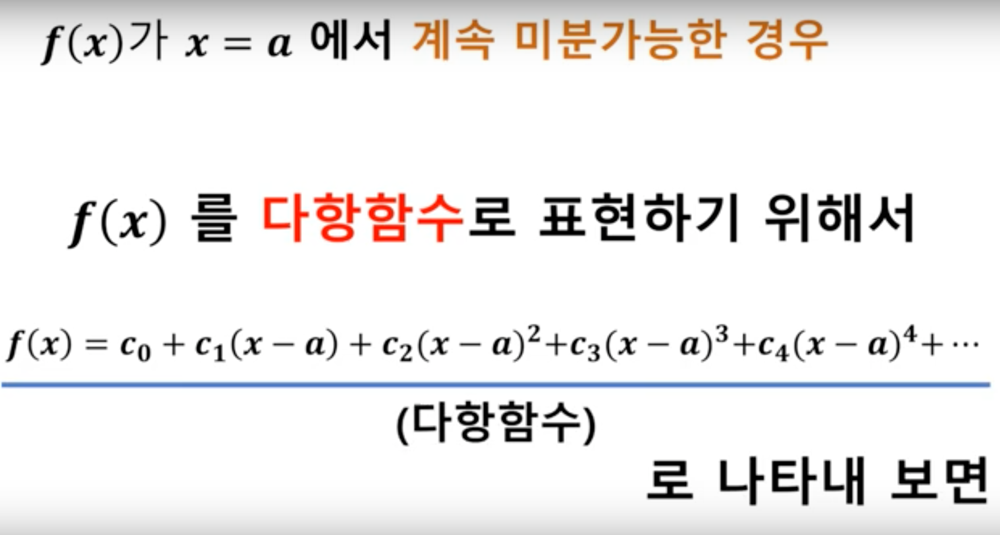{width=250px}

  \endcol
\endcols


## 3-3. 테일러 급수 근사 (2)

\begincols
  \begincol{.50\textwidth}
  
- 테일러 급수란? 좋은 동영상 [테일러급수 알아보기](https://www.youtube.com/watch?v=Ku2B3_GF7KI)

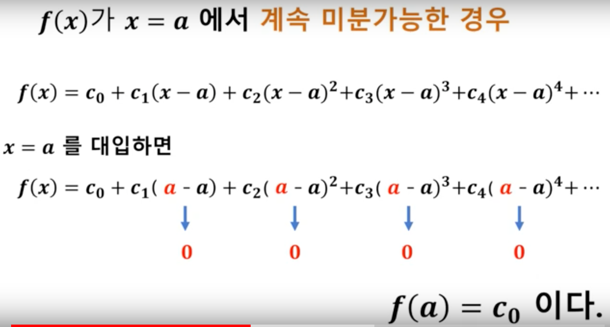{width=250px}

  \endcol
\begincol{.50\textwidth}

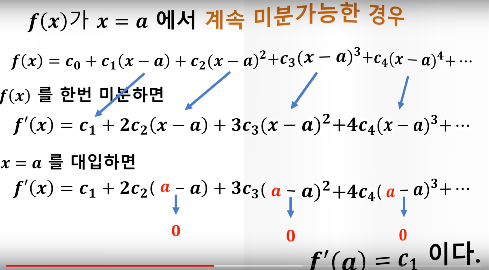{width=250px}

  \endcol
\endcols


## 3-3. 테일러 급수 근사 (3)

\begincols
  \begincol{.50\textwidth}
  
- 테일러 급수란? 좋은 동영상 [테일러급수 알아보기](https://www.youtube.com/watch?v=Ku2B3_GF7KI)

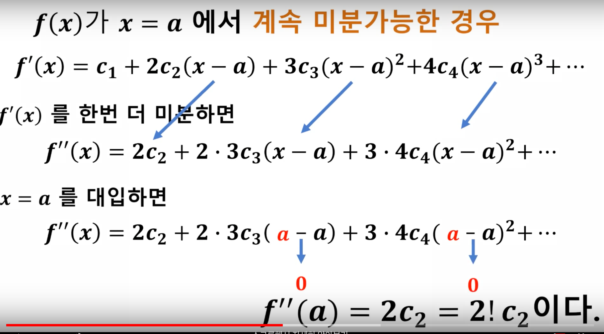{width=250px}

  \endcol
\begincol{.50\textwidth}

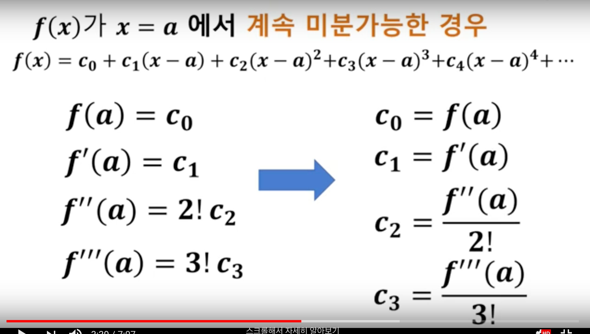{width=250px}

  \endcol
\endcols


## 3-3. 테일러 급수 근사 (4)

\begincols
  \begincol{.50\textwidth}
  
- 테일러 급수란? 좋은 동영상 [테일러급수 알아보기](https://www.youtube.com/watch?v=Ku2B3_GF7KI)

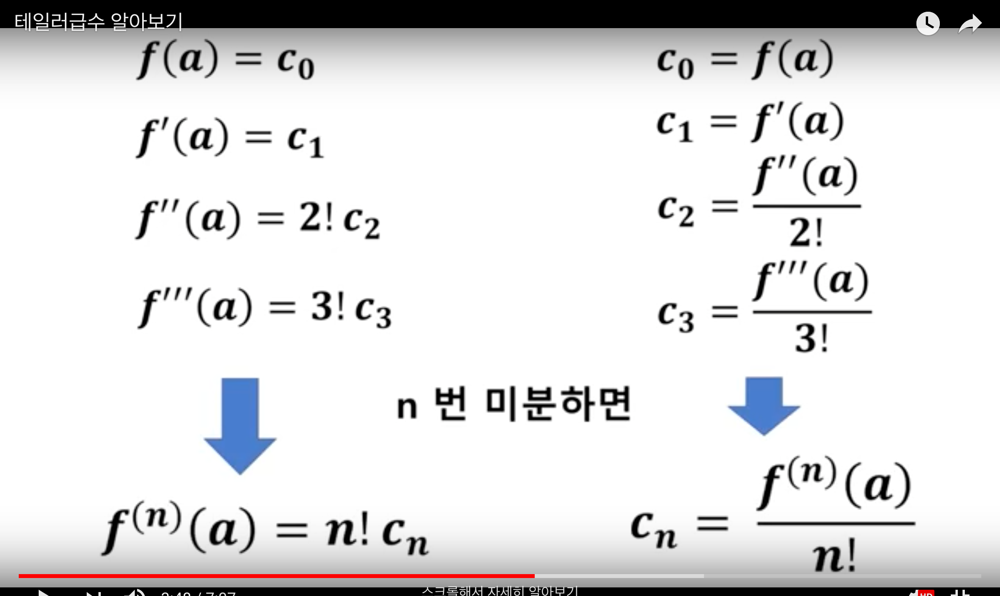{width=250px}

  \endcol
\begincol{.50\textwidth}

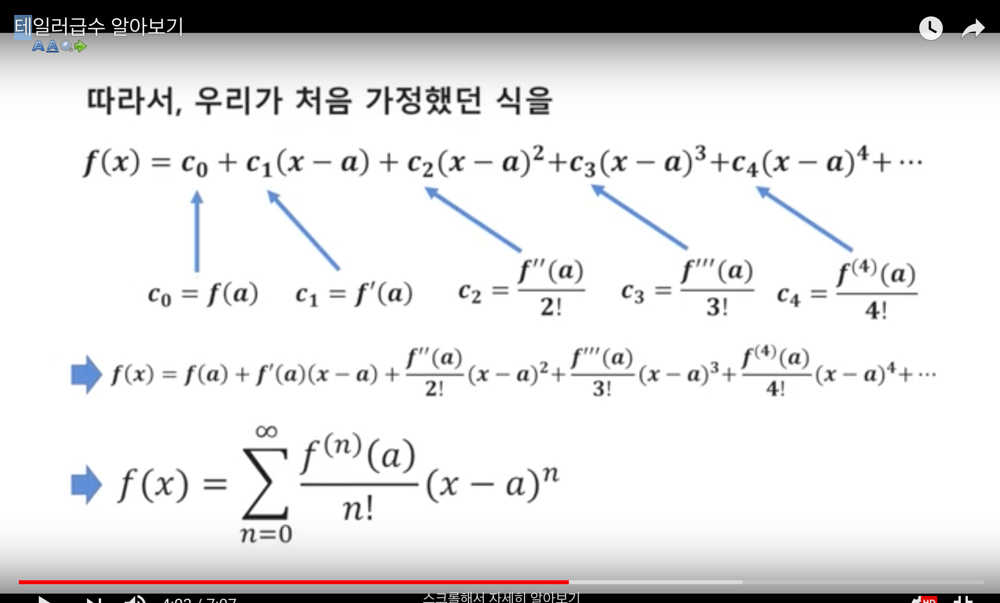{width=250px}

  \endcol
\endcols


## 3-3. 테일러 급수 근사 (5)

\begincols
  \begincol{.50\textwidth}
  
- 테일러 급수란? 좋은 동영상 [테일러급수 알아보기](https://www.youtube.com/watch?v=Ku2B3_GF7KI)

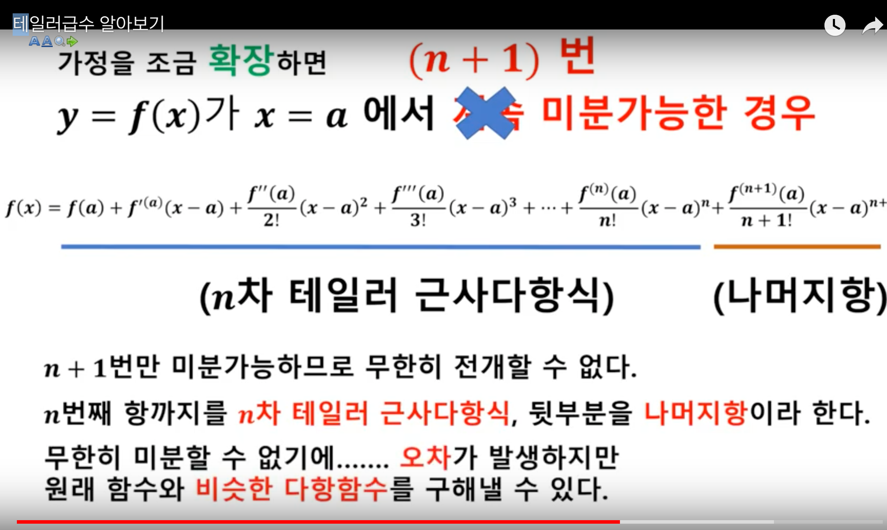{width=250px}

  \endcol
\begincol{.50\textwidth}

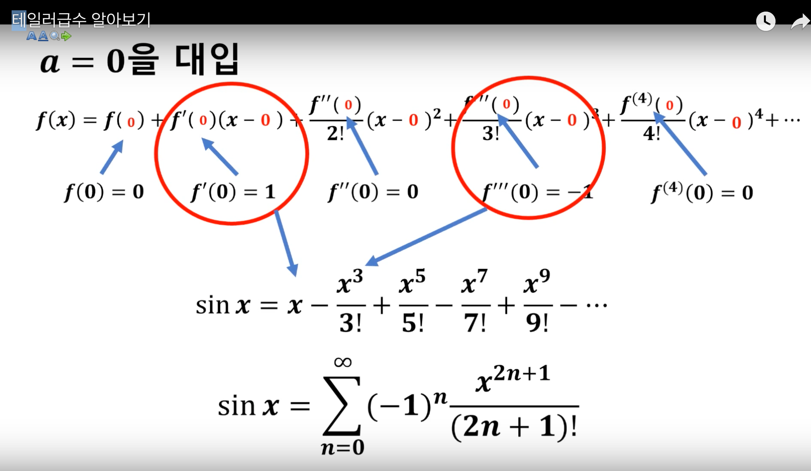{width=250px}

  \endcol
\endcols


## 3-3. 테일러 급수 근사 (6)

- 테일러 급수 근사란?
- 델타 기법 : 1차 테일러 급수를 사용해 통계량 theat hat의 분산을 근사하는 방법

[확률변수 함수의 분포를 알아보자 - Delta method에 대하여 (1)](https://issactoast.com/133)

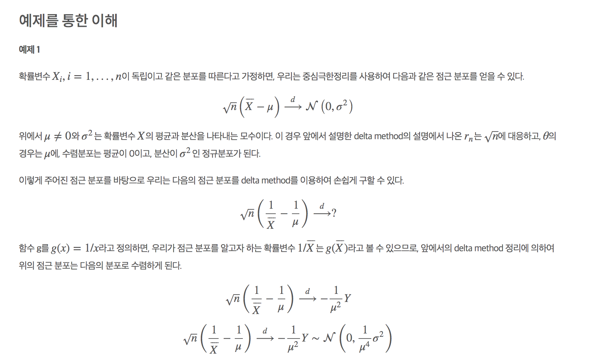{width=300px}

[Delta method에 대하여 (1)](https://issactoast.com/133)

## 3-4. 다른 방법들

- [3] 모수적 패밀리와 최대우도 이론 : MLE의 표준오차에 대한 이론적 표현은 4,5장에 설명되어 있음 (피셔 이론, 테일러 급수 근사, 플러그인 원리 사용)

- [4] 시뮬레이션과 부트스트랩 (10장에서 자세히 다룰 예정) : F의 추정 F hat을 시뮬레이션 하여 경험적 표준편차 등을 구하는 것

- [5] 피봇 통계량 : 확률분포 F에 종속되지 않는 것. (스튜던트 2표본 t검정)


## 3-5. 피봇 통계량

\FontSmall

- 스튜던트 T 분포 통해서 확률분포 F 대신 귀무가설을 검정
- 스튜던트 2표본 T검정 수행하여 문제를 푸는데... 2표본 문제에서는 숫자의 집합 2개를 관찰
- x1 = (x11,x12,...,x1n1), x2 = (x21,x22,...,x2n2)

- 다만 스튜던트 2표본 T검정을 하기 위한 4가지 조건

1. 자료는 모두 동일 간격을 가진 연속형 수치
2. 두 집단은 서로 독립적
3. 자료의 수치는 정규성을 가져야 함
4. 두 집단 각각에서 추정된 분산은 동일해야 함

- 둘이 같은 정규분포이기 때문에, 평균이 같다라는 귀무가설을 검정
- 평균끼리의 차이는 Normal (0, sigma^2(1/n1+1/n2))의 분포를 따르게 됨
- 스튜던트 분포를 사용해서 시그마의 값과 상관없이 동일한 분포(n1+n2-2차의 자유도를 가지는 스튜턴드 T분포) 통해서 피봇 통계량을 계산
- 다만 피봇성은 대부분 통계 상황에서 존재하지 않음...


## 3-6. Winsorized mean (1)

- 윈저화 평균은 이상값(outlier)이 있을 경우에 사용하는 통계량
- 절사 평균(trimmed mean)과 비슷함
- 1, 2, 3, 4, 5, 6, ...., 100 데이터가 있을 때 
- 절사 평균은 가장 작은 5개와 가장 큰 5개를 제외한 값 {6, 7, 8, ..., 94, 95}를 사용
- 윈저화 평균은 가장 작은 5개 대신 그것보다 바로 위의 값인 6으로 대체하고, 가장 큰 5개 대신 그것보다 바래 아래의 값인 95로 대체
- {6, 6, 6, 6, 6,    6, 7, 8, ...., 94, 95,    95, 95, 95, 95, 95}


## 3-6. Winsorized mean (2)

\tiny
```{r}
mean(c(1:10, 300))
mean(c(1:10, 300), trim=.05)
mean(c(1:10, 300), trim=.1)
```

\tiny
```{r}
winsorMean <- function(x, probs=c(0.05, 0.95)) { 
 xq<-quantile(x,probs=probs) 
 x[x < xq[1]] <-xq[1] 
 x[x > xq[2]] <-xq[2] 
 return(mean(x)) 
} 

winsorMean(c(1:10, 300))
``` 


## 3-7. 빈도주의 최적성

- 빈도적 기법이 대중화된 것은? 상대적으로 단순한 수학적 모델링 가정
- 오직 확률 모델(F)와 알고리즘 t(x)만 가정하면 됨
- gfr 분포의 위치를 추정하기 위해 **표본 평균**을 쓸것인가? **윈저화 평균**을 쓸것인가? 

- 주어진 모델 F에 대해 최적의 t(x)를 고르는 방법이 발견됨

1. 피셔의 최대 우도 추정 이론 (4장)
2. 피셔 정보 범위 (4장)

- 같은 맥락으로 네이만-피어슨의 보조정리(lemma)는 최적 가설 감정 알고리즘 제시


## 3-8. 네이반-피어슨의 보조정리(lemma)

\FontSmall

- 귀무가설 H0에 대한 가능도 함수의 값과 대립가설 H1의 가능도 함수 값을 가지고 비(ratio)를 구해보면 가능도비(likelihood ratio)라는 것이 구해지는데, 이 값이 적절한 상수 k보다 작은 경우 해당 기각역 C는 최량기각역(best critical region of size σ)
- 최량기각역은 가설검정에서 표본크기가 정해져 있다면 1/2종 오류를 동시에 줄일 수 있는 방법이 없음, 정해진 유의수준에서 검정력을 최대로 하는 기각역 설정 필요 (최적의 기각역 : 최량 기각역)

  * 1종 오류? 귀무가설이 참인에도 불구하고, 귀무가설을 기각할   오류 (실제로 효과가 없는데 효과가 있다고 나타내는 것)(alpha)
  * 2종 오류? 대립가설이 참인데도 불구하고 대립가설을 기각할 오류 (실제로 효과가 있는데 효과가 없다고 나타내는 것) (beta)
  * 1 - beta가 검정력, a가 유의수준

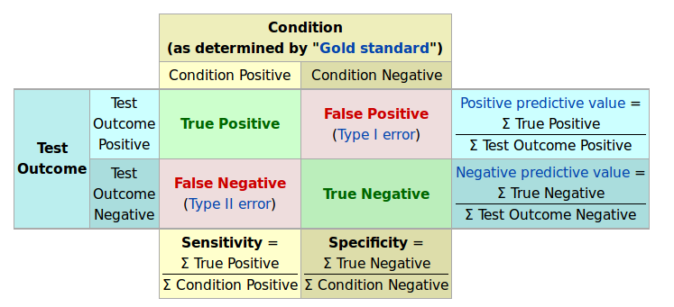{width=250px}


## 3-9. 주석 및 상세설명

- "빈도주의"라는 이름은 리차드 폰 미제스의 **확률의 빈도주의 이론**에서 유래됨
- 네이만은 통계적 유사성으로부터 유추해 제안한 것으로 보임 (1977년 논문 "빈도주의 확률과 빈도주의 통계량")
- 통계량 t(x)의 장기적인 행동에 근거를 두기 때문에 행동주의라는 이름이 어울리다는 말도 있음
