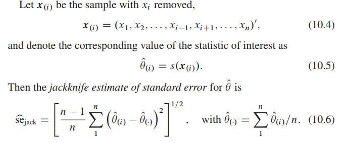
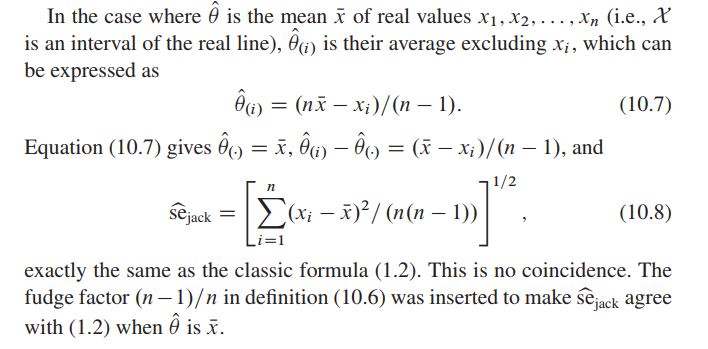
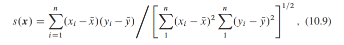
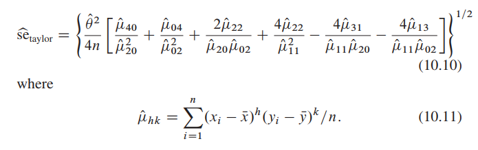
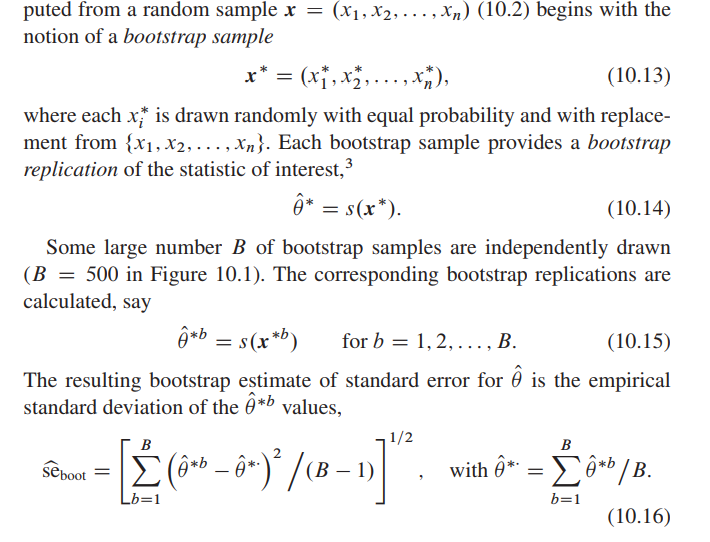
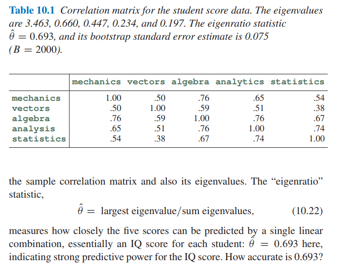
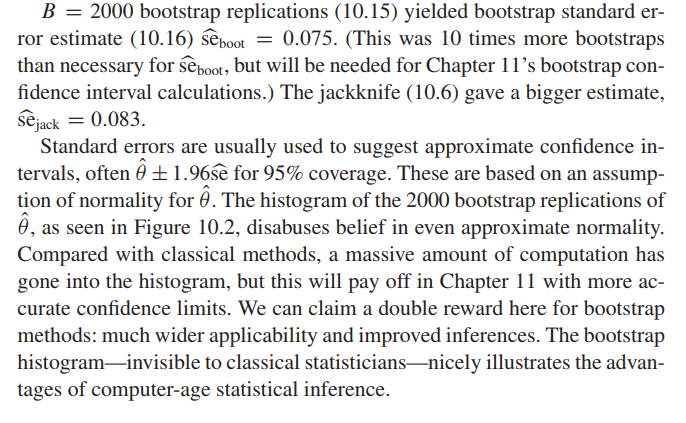
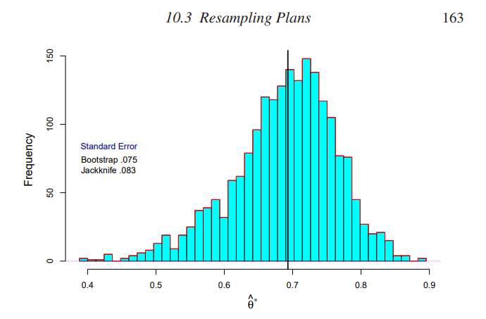
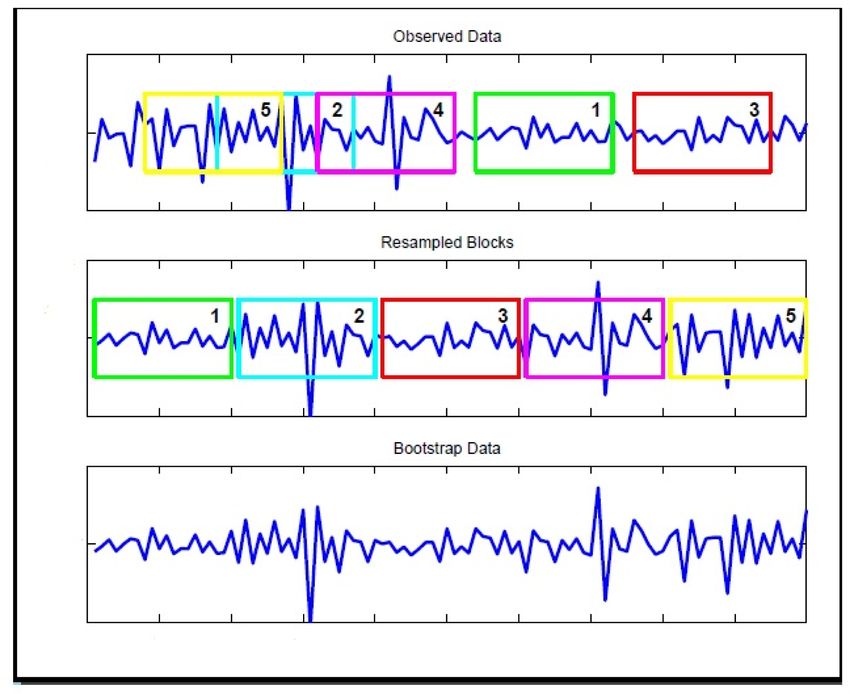

```{r setup, echo=FALSE, include=FALSE}
knitr::knit_hooks$set(mysize = function(before, options, envir) {
  if (before) 
    return(options$size)
})
knitr::opts_chunk$set(size='\\small')
knitr::opts_chunk$set(warning=FALSE)
knitr::opts_chunk$set(message=FALSE)
knitr::opts_chunk$set(fig.align='center')

require(tidyverse)
require(gtools)
set.seed(2310)
```


## 스터디는?

- 데이터뽀개기 커뮤니티(https://www.facebook.com/groups/databreak/) 스터디입니다
- 매주 수요일 진행 (7 ~ 8월)
- 장소는 판교에서 진행 (다만 이후 변경되면 재공지 할 예정)

[github 주소](https://github.com/KaggleBreak/Statistical-Inference)

- github 레퍼지토리는 clone 하셔서 발표 자료는 github 통해서 올려주세요!
  
[스터디원 명부 : github 주소 적어주세요, 구글드라이브](https://docs.google.com/spreadsheets/d/1-FL8Wk6RutM_wM-omrLwd6h5S9LYXh42roDehZPn9eg/edit?usp=sharing)


## 교재?

- http://www.yes24.com/Product/Goods/71829251 (번역본)
- https://web.stanford.edu/~hastie/CASI_files/PDF/casi.pdf (영문판)

- 영문판으로 보셔도 되고, 번역본으로 보셔도 됩니다. 편하신 대로

## 발표

- 7장 제임스-스타인 추정과 리지 회귀
- 10장 잭나이프와 부트스트랩


## 10-1. Intro

\FontSmall

- 빈도주의 추론의 핵심 요소는 표준오차 
- 잭나이프 (jackknife, 1957)는 표준오차를 계산할 때 복잡한 공식을 사용하지 않고 비정형화된 접근 방법을 사용한 컴퓨터 기반 계산의 첫걸음
- 부트스트랩(1979)은 한 걸음 더 나아가 표준오차를 포함한 폭넓고 다양한 추론 계산을 더욱 자동화

{width=450px}


## 10-2. 표준오차에 대한 잭나이프 추정 (1)

\FontSmall

- 잭나이프의 기본 응용은 1-표본 문제에 적용됨
- 1-표본 문제에서 통계학자들은 어떤 공간 X상의 미지의 확률분포 F로부터 독립적이고 동일한 분포 (iid) 분포 x = (x1, x2, ..., xn)을 관찰

{width=200px}

{width=200px}


## 10-2. 표준오차에 대한 잭나이프 추정 (2)

\FontSmall

- 전통적인 표준오차 공식과 똑같음, 이론적 테일러 급수 계산은 컴퓨터 계산력으로 대체
- 테일러 급수 식은 상당한 계산량을 수반하는 것처럼 보임

{width=250px}

{width=250px}


## 10-2. 표준오차에 대한 잭나이프 추정 (3)

\FontSmall

- 잭나이프 공식이 가지고 있는 다음과 같은 몇가지 특징

1. 비모수적 (기저 분포 F에 대한 어떠한 형태의 가정도 필요 없음)
2. 완전히 자동화돼 있다. 단일 마스터 알고리즘으로 데이터 집합 x와 함수 s(x)를 입력으로 해서 jack 표준오차 hat를 출력할 수 있음
3. 알고리즘 크기는 n이 아니라 n-1인 데이터 집합에서 작동한다. 표본 크기에 대해 매끈한다는 숨겨진 가정이 있다. 이는 표본 크기가 짝수인지 홀수인지에 따라 서로 다른 정의를 가지는 중앙값 같은 표본 통계량의 경우 골칫거리가 될 수 있음
4. 잭나이프 표준오차는 참 표준오차의 추정에 대해 상방향으로 편향된다.


## 10-2. 표준오차에 대한 잭나이프 추정 (4)

\FontSmall

- 잭나이프 공식이 가지는 주 약점 : 지역 미분에 종속된 성질

[10.1 The Jackknife Estimate of Standard Errors](https://nbviewer.jupyter.org/github/jrfiedler/CASI_Python/blob/master/chapter10/ch10s01.ipynb)

- 점선으로 된 파란색 수직선은 20, 25, ... 85세에서 측정된 lowess 곡선의 +- 2 잭나이프 표준오차를 보여줌
- 나이 25세에는 엉망이 되는데, 지역 미분이 표분 x의 전역 변화에 대해 lowess 곡선의 민감도를 크게 과장


## 10-3. 비모수적 부트스트랩 (1)

\FontSmall

- 부트스트랩 관점에서 보면 잭나이프는 전통적 기법과 최신의 전자식 컴퓨터를 최대로 사용한 것의 중간쯤에 있다.
- 부트스트랩은 F대신 추정 F hat으로 대체하고 직접 시뮬레이션을 통해 빈도주의 표준을 추정하는 것 (전자식 컴퓨터 등장 이후에나 가능한 전술)

{width=250px}


## 10-3. 비모수적 부트스트랩 (2)

\FontSmall

- 어떤 큰 수 B개만큼의 부트스트랩 표본은 독립적으로 추출됨
- 경험적 표준편차 (두 단계에 걸쳐 얻어지게됨)
- x가 확률분포 F로부터 iid 추출돼 생성되고, 그다음 theat hat이 알고리즘 s()에 따라 x로부터 계산됨
- F를 알 수 없지만 각 점 xi에 1/n의 확률을 부여하는 경험적 확률분포 F hat을 사용해 추정할 수 있음 
- 부트스트랩 x*가 F hat으로부터 iid 표본추출된 것
- n이 커질수록 F hat이 F에 접근한다는 사실은 대부분의 경우에 boot 표준오차가 theta hat의 참 표준오차에 접근한다는 것을 의미

{width=300px}


## 10-3. 비모수적 부트스트랩 (3)

\FontSmall

- 부트스트랩 표준오차 hat에 대해 강조할 필요가 있는 몇 가지 중요사항

1. 완전히 자동. 이 방법 역시 한 번 마스터 알고리즘을 작성하고나면, 데이터 x와 s()을 입력으로 해서 boot 표준오차 hat를 출력할 수 있다.
2. 1-표본 비모수적 부트스트랩을 설명했다. 모수적 및 다표본 버전은 나중에 살펴본다.
3. 부트스트래핑은 잭나이프에 비해 원시 데이터를 더 공격적으로 '흔들어서' x로부터 x'의 비지역 편차를 생성한다. 부트스트랩은 미분 불능의 통계량에 대해서는 잭나이프보다 더 신뢰할 수 있는데, 지역 도함수에 종속되지 않기 때문이다.
4. B = 200 정도면 대개 boot 표준오차 hat를 계산하기에 충분한 크기다. 11장에서의 부트스트랩 신뢰구간을 위해서는 더 큰 값인 1000이나 2000이 필요하다.
5. 표준오차에 대해 특별히 따로 해야 할 작업이 없다. 그저 부트스트랩 복제를 사용해 기대 절대 오차나 다른 정확도 척도를 계산하면 된다.
6. 피셔의 MLE 공식은 se를 이론적으로 계산한 다음 theta를 theta hat으로 플러그인 한다. 


## 10-3. 비모수적 부트스트랩 (4)

\FontSmall

- 잭나이프는 그 가정이나 응용에서 모두 완전히 빈도주의 도구
- 부트스트랩 또한 기본적으로 빈도주의지만 (10.21)과의 연계와 같이 일부 피셔가 들어있다.
- 그 유용성으로 인해 추정과 예측 문제에서 다양한 응용에 쓰이고 있으며 베이즈주의와도 어느정도 연계되어 있다.

{width=240px}


## 10-3. 비모수적 부트스트랩 (5)

- 표준오차는 95% 구간에서의 1.96, theat hat의 정규성이 가정돼어 있지만 잘못이라는 점을 알려줌

{width=250px}


## 10-3. 비모수적 부트스트랩 (6)

{width=200px}


## 10-4. 극소 잭나이프

- 잘모르겠으니 생략 (17장이나 20장에서 다룬다고 함)


## 10-5. 다표본 부트스트랩

\FontSmall

[10.3 Resampling Plans](https://nbviewer.jupyter.org/github/jrfiedler/CASI_Python/blob/master/chapter10/ch10s03.ipynb)

- 0.235는 얼마나 정확한가? (AML과 ALL 스코어의 중앙값 차이)
- 일반적 2-표본 t-검정 통계량과 순열 히스토그램과 놀라울 만큼 일치 (중앙값 차에 기초)
- 순열 검정은 재표본추출의 또 다른 형태로 간주할 수 있음


## 10-6. 이동 블록 부트스트랩

\FontSmall

- x = (x1, x2, ..., xn)이 iid 표본이 아니라 시계열이라고 가정, 의미있는 순서를 가지고 발생하며, 근접한 관측치는 서로 상관됐을 가능성이 높음
- 파라메트릭 시계열 모델을 대체할 수있는 간단한 리샘플링 알고리즘으로, 모델 선택을 피하고 움직이는 블록 길이의 추정만 요구. 대략 독립적인 이동 블록을 사용하여 관측된 시계열을 리샘플링
- Moving block 부트스트래핑은 Kunsch(1989)와 Liu와 Singh(1992)에 의해 독립적으로 소개된 것으로 Efron (1979)이 weakly dependent stationary data에 적용한 부트스트래핑을 개선하기 위해 제안되었음
- h시점 후의 부트스트랩 조건부 분산의 예측치를 구할 수 있음

{width=250px}


## 10-7. 베이즈 부트스트랩 (1)

[The Non-parametric Bootstrap as a Bayesian Model](http://www.sumsar.net/blog/2015/04/the-non-parametric-bootstrap-as-a-bayesian-model/)

[Easy Bayesian Bootstrap in R](http://www.sumsar.net/blog/2015/07/easy-bayesian-bootstrap-in-r/)

- In Bayesian bootstrap multinomial distribution is replaced by Dirichlet distribution

## 10-7. 베이즈 부트스트랩 (2)

\tiny
```{r}
# Bayesian bootstrap
mean.bb <- function(x, n) {
  apply(rdirichlet(n, rep(1, length(x))), 1, weighted.mean, x = x)
}
# standard bootstrap
mean.fb <- function(x, n) {
  replicate(n, mean(sample(x, length(x), TRUE)))
}
reps <- 100000
x <- cars$dist
system.time(fbq <- quantile((mean.fb(x, reps)), c(0.025, 0.075)))
system.time(bbq <- quantile((mean.bb(x, reps)), c(0.025, 0.075)))
print(rbind(fbq, bbq))
```


## 10-8. 모수적 부트스트랩

[10.4 The Parametric Bootstrap](https://nbviewer.jupyter.org/github/jrfiedler/CASI_Python/blob/master/chapter10/ch10s04.ipynb)

## 10-9. 영향 함수와 안정적 추정

[10.5 Infuence Functions and Robust Estimation](https://nbviewer.jupyter.org/github/jrfiedler/CASI_Python/blob/master/chapter10/ch10s05.ipynb)

## 10-10. 주석 및 상세설명

- Quenouile(1956) : 지금은 편차의 잭나이프 추정으로 불리는 방법을 소개
- 튜키(1958) : 커뉴-형식 계산을 비모수적 표준오차 추정에 맞도록 수정할 수 있음을 알아내어 공식을 '잭나이프'라 명명
- 에프론(1979) : 부트스트랩은 잭나이프의 성공과 실패를 좀 더 잘 이해하기 위한 시도로 시작, 급성장하는 컴퓨터 성능은 부트스트랩의 주요 걸림돌인 엄청난 계산량을 극복하고 보편적으로 사용할 수 있도록 만들어줌
- 재클(1972) : 극소 잭나이프와 경험적 영향 함수, 그리고 비모수적 델타 기법을 만듦
